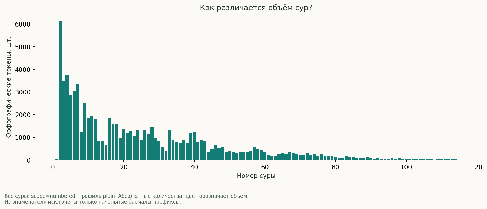
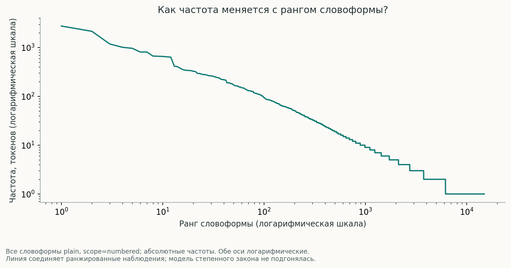
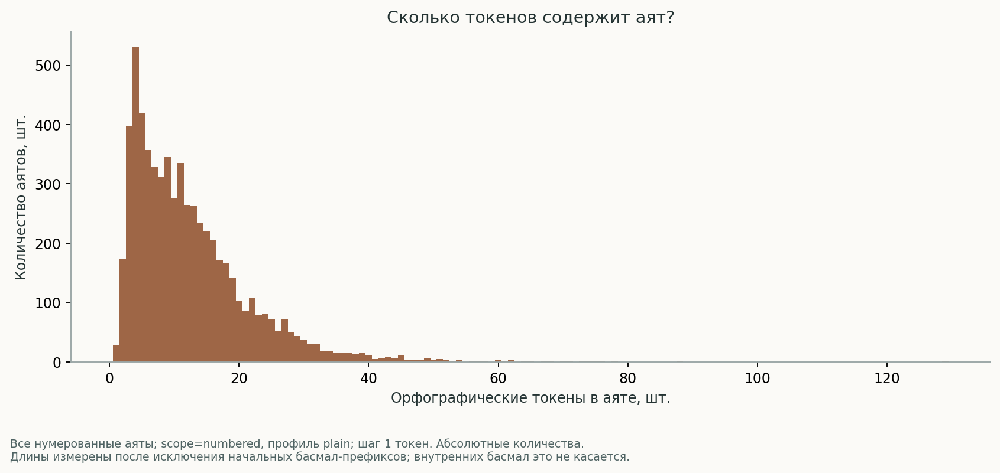
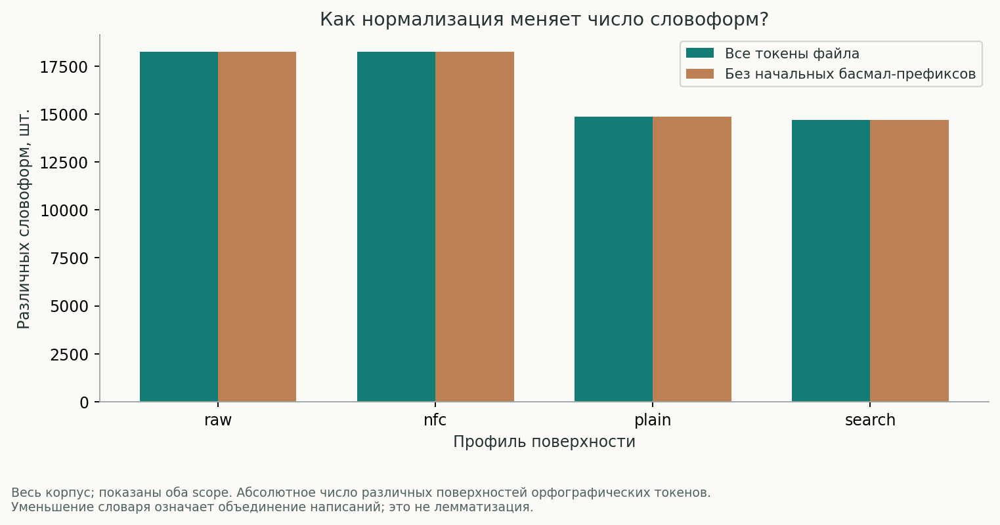
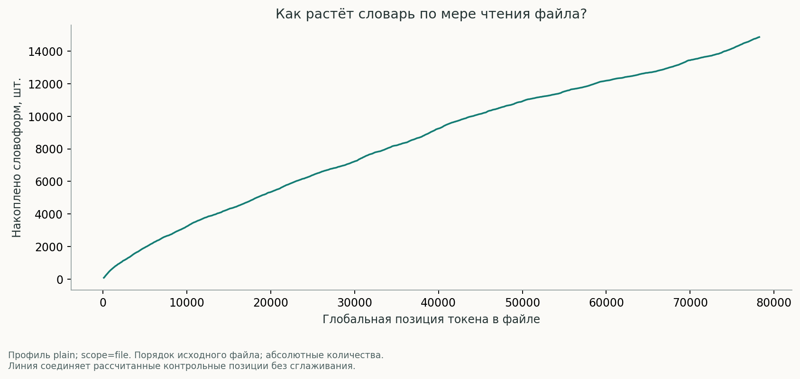
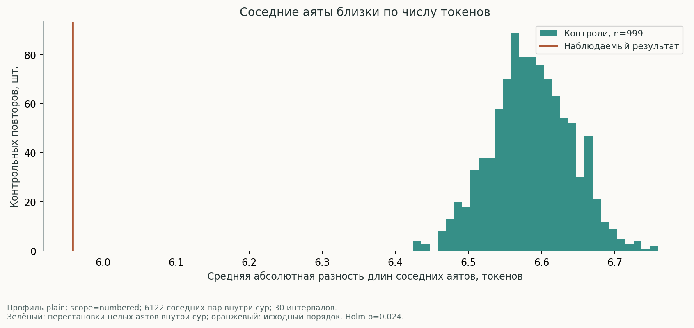
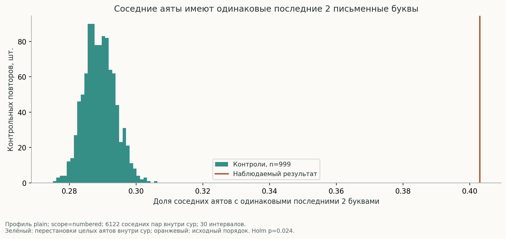

# Исследование арабского текста Корана

Откройте [интерактивный отчёт](../dashboard/index.html): он содержит весь индекс орфографических токенов и работает локально без сервера и интернета. [XLSX](../exports/quran_analysis.xlsx) предназначен для изучения компактных таблиц; полные таблицы и индексы перечислены ниже.

## Паспорт корпуса

В данном файле рассчитано 114 сур, 6,236 нумерованных аятов и 78,248 орфографических токенов. Область `numbered` содержит 77,800 токенов: исключены 448 токенов начальных басмал-префиксов. Басмалы 1:1 и внутри 27:30 сохранены. Эти количества описывают данный файл и выбранные правила, а не универсальные количества для всех редакций.

| Профиль | Токены file | Словоформы file | Токены numbered | Словоформы numbered |
|---|---:|---:|---:|---:|
| `raw` | 78248 | 18243 | 77800 | 18242 |
| `nfc` | 78248 | 18243 | 77800 | 18242 |
| `plain` | 78248 | 14868 | 77800 | 14868 |
| `search` | 78248 | 14691 | 77800 | 14691 |

Источник таблицы: [presentation_corpus_metrics.csv](../results/tables/presentation_corpus_metrics.csv). Письменная словоформа не равна лемме или корню.

SHA-256 исходника: `295faa755008d0a292d2e285368a06dc478bf37cb5f29ed29bb06d7c6ca0bf0a`. Все 1352595 байт и 6236 записей обработаны; 114 последовательно пронумерованных сур без внутренних пропусков. Тождество полному внешнему эталону не подтверждено. Происхождение: Не установлено по самому файлу.

## Главное, что установлено

- **Морфология имеет измеренное неполное покрытие:** надёжно связаны 70,655 из 77,800 токенов numbered (90.82%). Частоты лемм и корней относятся к этой выровненной части; токены группового соответствия считаются связанными с группой, не обязательно с точным сегментом.
- **Статистическая структура зависит от модели:** 24 из 24 первичных тестов отвергают выбранные перестановочные модели после общей поправки Holm при α=0.05; на тест выполнено 999 контрольных повторов. Это совместимо с обычной языковой, грамматической и риторической структурой. Независимого подтверждающего корпуса нет.
- **Чувствительность к басмале:** формы الله и الرحيم профиля plain встречаются во всех сурах в области file; после исключения начальных басмал-префиксов в numbered ни одна форма не охватывает все суры.
- **Опубликованный счёт месяца:** при указанном морфологическом правиле получено 12 проверенно связанных вхождений, непроверенных кандидатов — 0. Статус: воспроизведено при заданных правилах. Это результат заданного правила, не универсальный подсчёт значения «месяц».
- **Опубликованное число 365 не подтверждено полностью на исходном файле:** надёжно связаны 362 включённых кандидата; ещё 3 требуют проверки выравнивания. Внешний итог не подставляется вместо результата пользовательского корпуса.

## Реестр результатов и статусов

Полные карточки с наблюдаемыми значениями, методами, ограничениями, источниками публикаций, эффектами и поправками находятся в [интерактивном каталоге](../dashboard/index.html#findings) и [машиночитаемом реестре](../results/hypotheses/registry.json). Здесь приведён компактный указатель. Пустое p-value не означает нулевую вероятность.

| Результат | Статус | Профиль / область | Полные исходные данные |
|---|---|---|---|
| Вступительные басмалы меняют поверхностные частоты | Описательный результат | raw / file vs numbered | [core_basmala_sensitivity.csv](../results/tables/core_basmala_sensitivity.csv) |
| Нормализация меняет число различаемых письменных форм | Описательный результат | raw/nfc/plain/search / file | [core_normalization_collisions.csv.gz](../results/tables/core_normalization_collisions.csv.gz) |
| Точные повторяющиеся аяты зависят от профиля записи | Проверенный описательный факт | plain / file | [exploration_exact_verse_repeats.csv](../results/tables/exploration_exact_verse_repeats.csv) |
| Длинные точные повторяющиеся последовательности | Кандидат ограниченного поиска | plain / file | [exploration_long_repeat_pairs.csv.gz](../results/tables/exploration_long_repeat_pairs.csv.gz) |
| Совпадения ограниченной целочисленной грамматики | Описательное совпадение; значимость не заявлена | plain / file | [exploration_numeric_tests.csv.gz](../results/tables/exploration_numeric_tests.csv.gz) |
| Ассоциации частых слов в аятах | Проверенный описательный факт | plain / file | [exploration_cooccurrence.csv.gz](../results/tables/exploration_cooccurrence.csv.gz) |
| Порядок токенов и степень сжатия | Описательное сравнение с контролями | plain / file | [exploration_compression_controls.csv](../results/tables/exploration_compression_controls.csv) |
| Охват всех сур зависит от вступительных басмал | Чувствительно к правилам подсчёта | plain/search / file vs numbered | [extension_basmala_lexical_coverage.csv.gz](../results/tables/extension_basmala_lexical_coverage.csv.gz) |
| Исключение повторённых аятов не устраняет сходство письменных окончаний | Исследовательский кандидат | plain / file/numbered | [extension_refrain_adjacency_edges.csv.gz](../results/tables/extension_refrain_adjacency_edges.csv.gz) |
| Пространство равных частот содержит множество пар | Точный факт для указанного файла и правил | plain / file/numbered | [extension_frequency_equality_groups.csv.gz](../results/tables/extension_frequency_equality_groups.csv.gz) |
| Сегменты отрицания | описательное | qac_v0.4_aligned / numbered_aligned | [morphology_linguistic_occurrences.csv.gz](../results/tables/morphology_linguistic_occurrences.csv.gz) |
| Обращения | описательное | qac_v0.4_aligned / numbered_aligned | [morphology_linguistic_occurrences.csv.gz](../results/tables/morphology_linguistic_occurrences.csv.gz) |
| Вопросительные сегменты | описательное | qac_v0.4_aligned / numbered_aligned | [morphology_linguistic_occurrences.csv.gz](../results/tables/morphology_linguistic_occurrences.csv.gz) |
| Повелительные глаголы | описательное | qac_v0.4_aligned / numbered_aligned | [morphology_linguistic_occurrences.csv.gz](../results/tables/morphology_linguistic_occurrences.csv.gz) |
| Имена собственные | описательное | qac_v0.4_aligned / numbered_aligned | [morphology_linguistic_occurrences.csv.gz](../results/tables/morphology_linguistic_occurrences.csv.gz) |
| Кандидаты числовых выражений по 12 корням | кандидат | qac_v0.4_aligned / numbered_aligned | [morphology_linguistic_occurrences.csv.gz](../results/tables/morphology_linguistic_occurrences.csv.gz) |
| Смена грамматического лица соседних глаголов внутри аята | кандидат | qac_v0.4_aligned / numbered_aligned | [morphology_verb_transitions.csv](../results/tables/morphology_verb_transitions.csv) |
| Публикация: شهر — 12 вхождений | воспроизведено при заданных правилах | qac_v0.4_aligned / numbered_aligned | [morphology_claim_occurrences.csv.gz](../results/tables/morphology_claim_occurrences.csv.gz) |
| Публикация: يوم — 365 вхождений | частично: неполное выравнивание | qac_v0.4_aligned / numbered_aligned | [morphology_claim_occurrences.csv.gz](../results/tables/morphology_claim_occurrences.csv.gz) |
| Публикация: басмала встречается 114 раз | воспроизведено при заданных правилах | plain / file | [morphology_claim_occurrences.csv.gz](../results/tables/morphology_claim_occurrences.csv.gz) |
| Публикация: 19 букв в басмале | воспроизведено при заданных правилах | written_letters_v1 / file | [morphology_claim_occurrences.csv.gz](../results/tables/morphology_claim_occurrences.csv.gz) |
| Пара الدنيا / الآخرة: по 115 | недостаточно специфицировано | qac_v0.4_aligned / numbered_aligned | [morphology_claim_occurrences.csv.gz](../results/tables/morphology_claim_occurrences.csv.gz) |
| Соседние аяты близки по числу токенов | Необычно относительно указанной модели после поправок | plain / file | [statistical_null_draws.csv.gz](../results/tables/statistical_null_draws.csv.gz) |
| Длина аята связана с положением внутри суры | Необычно относительно указанной модели после поправок | plain / file | [statistical_null_draws.csv.gz](../results/tables/statistical_null_draws.csv.gz) |
| Соседние аяты имеют одинаковые последние 2 письменные буквы | Необычно относительно указанной модели после поправок | plain / file | [statistical_null_draws.csv.gz](../results/tables/statistical_null_draws.csv.gz) |
| Соседние аяты имеют одинаковые последние 3 письменные буквы | Необычно относительно указанной модели после поправок | plain / file | [statistical_null_draws.csv.gz](../results/tables/statistical_null_draws.csv.gz) |
| Соседние аяты близки по числу токенов | Необычно относительно указанной модели после поправок | plain / file | [statistical_null_draws.csv.gz](../results/tables/statistical_null_draws.csv.gz) |
| Длина аята связана с положением внутри суры | Необычно относительно указанной модели после поправок | plain / file | [statistical_null_draws.csv.gz](../results/tables/statistical_null_draws.csv.gz) |
| Соседние аяты имеют одинаковые последние 2 письменные буквы | Необычно относительно указанной модели после поправок | plain / file | [statistical_null_draws.csv.gz](../results/tables/statistical_null_draws.csv.gz) |
| Соседние аяты имеют одинаковые последние 3 письменные буквы | Необычно относительно указанной модели после поправок | plain / file | [statistical_null_draws.csv.gz](../results/tables/statistical_null_draws.csv.gz) |
| Частые словоформы неравномерно распределены внутри аята | Необычно относительно указанной модели после поправок | nfc / file | [statistical_null_draws.csv.gz](../results/tables/statistical_null_draws.csv.gz) |
| Частые словоформы неравномерно распределены внутри аята | Необычно относительно указанной модели после поправок | nfc / file | [statistical_null_draws.csv.gz](../results/tables/statistical_null_draws.csv.gz) |
| Частые словоформы неравномерно распределены внутри аята | Необычно относительно указанной модели после поправок | plain / file | [statistical_null_draws.csv.gz](../results/tables/statistical_null_draws.csv.gz) |
| Частые словоформы неравномерно распределены внутри аята | Необычно относительно указанной модели после поправок | plain / file | [statistical_null_draws.csv.gz](../results/tables/statistical_null_draws.csv.gz) |
| Соседние аяты близки по числу токенов | Необычно относительно указанной модели после поправок | plain / numbered | [statistical_null_draws.csv.gz](../results/tables/statistical_null_draws.csv.gz) |
| Длина аята связана с положением внутри суры | Необычно относительно указанной модели после поправок | plain / numbered | [statistical_null_draws.csv.gz](../results/tables/statistical_null_draws.csv.gz) |
| Соседние аяты имеют одинаковые последние 2 письменные буквы | Необычно относительно указанной модели после поправок | plain / numbered | [statistical_null_draws.csv.gz](../results/tables/statistical_null_draws.csv.gz) |
| Соседние аяты имеют одинаковые последние 3 письменные буквы | Необычно относительно указанной модели после поправок | plain / numbered | [statistical_null_draws.csv.gz](../results/tables/statistical_null_draws.csv.gz) |
| Соседние аяты близки по числу токенов | Необычно относительно указанной модели после поправок | plain / numbered | [statistical_null_draws.csv.gz](../results/tables/statistical_null_draws.csv.gz) |
| Длина аята связана с положением внутри суры | Необычно относительно указанной модели после поправок | plain / numbered | [statistical_null_draws.csv.gz](../results/tables/statistical_null_draws.csv.gz) |
| Соседние аяты имеют одинаковые последние 2 письменные буквы | Необычно относительно указанной модели после поправок | plain / numbered | [statistical_null_draws.csv.gz](../results/tables/statistical_null_draws.csv.gz) |
| Соседние аяты имеют одинаковые последние 3 письменные буквы | Необычно относительно указанной модели после поправок | plain / numbered | [statistical_null_draws.csv.gz](../results/tables/statistical_null_draws.csv.gz) |
| Частые словоформы неравномерно распределены внутри аята | Необычно относительно указанной модели после поправок | nfc / numbered | [statistical_null_draws.csv.gz](../results/tables/statistical_null_draws.csv.gz) |
| Частые словоформы неравномерно распределены внутри аята | Необычно относительно указанной модели после поправок | nfc / numbered | [statistical_null_draws.csv.gz](../results/tables/statistical_null_draws.csv.gz) |
| Частые словоформы неравномерно распределены внутри аята | Необычно относительно указанной модели после поправок | plain / numbered | [statistical_null_draws.csv.gz](../results/tables/statistical_null_draws.csv.gz) |
| Частые словоформы неравномерно распределены внутри аята | Необычно относительно указанной модели после поправок | plain / numbered | [statistical_null_draws.csv.gz](../results/tables/statistical_null_draws.csv.gz) |

## Карта покрытия

Полнота утверждается только в границах указанных конечных семейств. Неограниченное пространство формул и все семантические отношения не перебирались.

| Направление | Анализ | Статус | Проверено / пространство | Ограничения |
|---|---|---|---|---|
| A | Полный аудит, Unicode, длины и огласовки всех единиц | complete | 6236 аятов; 78248 токенов; 68 кодовых точек / Все строки, кодовые точки, токены, аяты и суры; 4 профиля × 2 области | Полнота относительно внешнего эталона и происхождение не установлены; письменные буквы не являются звуками. |
| B | Полные поверхностные словари, частоты частот и словарь каждой суры | complete | 132088 / Каждая наблюдаемая токен-форма; raw/nfc/plain/search; file/numbered | Это орфографические формы, не леммы; морфология в отдельном модуле. Специфичность — описательный сглаженный log-odds. |
| C | Словесные n-граммы | complete_within_scope | 251513 / {'profile': 'plain', 'scope': 'file', 'n': [2, 3, 4, 5], 'cross_verse': False, 'overlap': True, 'nonoverlap': 'greedy earliest-start per verse, separately per n-gram'} | Полный перебор в объявленном диапазоне; другие профили и сквозные n-граммы не вычислялись. |
| C | Буквенные n-граммы | complete_within_scope | 540963 / {'n': [2, 3, 4], 'boundary': 'token', 'unit': 'Unicode Letter', 'nonoverlap': 'greedy earliest-start per token, separately per n-gram'} | Только письменные буквы plain; комбинируемые знаки пропускаются. Межсловные последовательности не исследованы. |
| C | Полностью повторяющиеся аяты | complete_within_scope | 49888 / {'profiles': ['raw', 'nfc', 'plain', 'search'], 'scopes': ['file', 'numbered']} | raw/file сравнивает raw_text целиком, включая пробелы и редакторские знаки; остальные варианты сравнивают последовательности токенов профиля. Семантическое равенство не проверяется. |
| C | Длинные точные повторы | partial_bounded_search | 7282 / {'seed_length': 5, 'seed_max_support': 40, 'min_tokens': 8} | Все пары разрешённых затравок расширены в обе стороны до границ аята. Повторы без затравки допустимой частоты могут быть пропущены. Для каждой найденной фразы frequency и адреса исчерпывающие; long_repeat_pairs содержит только пары, полученные расширением. |
| C | Приблизительные совпадения аятов | partial_bounded_search | 18086 / {'approximate_seed_length': 3, 'approximate_seed_max_verse_support': 25, 'approximate_min_verse_tokens': 5, 'approximate_jaccard_alignment_threshold': 0.4, 'approximate_similarity_min': 0.8} | Кандидат должен иметь общую затравку допустимой поддержки; Jaccard множества форм для всех кандидатов, SequenceMatcher только при Jaccard≥порога. Это не полный перебор всех пар и не редакционное расстояние. Первый аргумент — более ранний аят; отношение SequenceMatcher может зависеть от порядка аргументов. |
| D | Интервалы, трети и концентрация всех словоформ | complete_within_scope | 14868 / {'types': 14868, 'profile': 'plain', 'window': 1000, 'step': 250, 'windows': 310, 'thirds_units': ['ayah', 'surah', 'corpus'], 'frequency_bands': ['1', '2-9', '10-99', '100+']} | Описательные оценки без p-value; окна в глобальных токенах могут пересекать границы сур, последнее полное окно дополнительно привязано к концу корпуса. В сводке промежутки аятов/сур — между различными занятыми единицами; word_occurrence_gaps сохраняет интервалы последовательных вхождений, включая нулевые. Точки изменения и совпадения профилей всех пар не исследованы. |
| E | Границы, половины и формальные зеркальные пары | complete_within_scope | 9327 / {'boundaries_n': [1, 2, 3], 'mirror': 'a ↔ A+1−a', 'half_unit': 'ayah'} | Нечётный центральный аят исключён из обеих половин. Равенство длин не означает смысловую симметрию; письменное окончание не трактуется как рифма. |
| F | Частотные классы и целочисленные равенства | complete_within_scope | 42408 / {'variables': ['surah_id', 'verses', 'tokens', 'letters', 'types', 'first_global_ayah', 'last_global_ayah', 'cumulative_tokens'], 'expressions': 'x; x+y (x≤y по имени)', 'comparison': 'expression == atomic_variable', 'divisors': [2, 3, 5, 7, 11, 19], 'rounding': 'нет', 'depth': 1, 'constants_in_equalities': []} | Сохранены совпадения и несовпадения; саморавенства и симметричные дубли атомарных равенств исключены заранее. Значимость не заявляется. Абджад, произвольные цифросклейки и числовые выражения языка в этот поиск не входят. |
| G | Совместное присутствие и сходство сур | complete_within_scope | 27861 / {'top_vocabulary': 120, 'pairs_per_context': 7140, 'contexts': {'verse': 6236, 'surah': 114, 'nonoverlap_window': 1505}, 'min_support': 5} | PMI/lift описательные, зависят от длины контекста; нулевые пары сохранены, для поддержки <5 support_pass=0. Окна по 50 токенов внутри сур; хвосты короче окна исключены. Леммы и корни сюда не входят. |
| H | Энтропия, рост словаря, равные окна и сжатие | complete_within_scope | 1028 / {'representation': 'plain tokens joined by one ASCII space, UTF-8', 'codec': 'zlib level 9', 'window': 500, 'controls': 19, 'vocabulary_growth_stride': 100, 'include_final_growth_position': True} | Энтропия нулевого порядка без модели синтаксиса; сырое TTR не используется для ранжирования сур. Короткие суры и хвосты не входят в сравнение фиксированных окон. Контроль сжатия разрушает весь порядок и не доказывает специфичность корпуса. Степенной закон и периодичность не заявляются. |
| B | Чувствительность охвата каждой формы к басмале | complete_bounded | 29559 / Все plain/search формы × file/numbered | Словоформа не равна понятию |
| E | Окончания с исключением рёбер повторённых аятов | complete_bounded | 24488 / Все исходные внутрисуровые соседства × 2 области × 2/3 буквы | Без новых рёбер; не причинный и не фонетический вывод |
| F | Все пары одинаковой частоты и их чувствительность | complete_bounded | {'pairs_file': 41683473, 'pairs_numbered': 41684499, 'preserved_pairs': 41683470, 'lost_pairs': 3, 'new_pairs': 1029, 'pair_intersection_over_union': 0.9999752425973567} / Неупорядоченные пары plain-форм; группы эквивалентности | Нет статистической интерпретации равенств |
| B | Морфология: сегменты, леммы, корни, POS и признаки | частично | 70655 / 77800 | Только надёжно выровненные токены numbered. Полный внешний источник сохранён отдельно; чужие частоты не подменяют корпус. |
| G | Совместная встречаемость лемм и корней | complete_bounded | 10620 / top-60 каждого уровня × все пары × аят/сура/перекрывающееся окно5 внутри аята | Бинарное присутствие по выровненным сегментам. Окна из 5 исходных numbered-токенов перекрываются, не пересекают границу аята. Нулевая совместная частота сохраняется; PMI/lift показаны только при поддержке ≥5. Неполное выравнивание и длина контекста влияют на ассоциации; это описательные меры без p-value. |
| I | Отрицания, обращения, вопросы, повелительные формы, имена; 12 корней числовых кандидатов; смена лица соседних глаголов | частично | 116320 / QAC v0.4, выровненные сегменты | Семантическая интерпретация, тематическая разметка, значения числовых конструкций и риторическая интерпретация переходов не валидированы. |
| J | Пять опубликованных утверждений: день, месяц, басмала 114/19, пара الدنيا/الآخرة | выполнено с ограничениями | 5 / 5 | Статусы индивидуальны; пара недостаточно специфицирована, непокрытые формы не считаются отсутствующими. |
| D | Внутриаятная локализация частых форм; повтор поиска максимума в контролях | complete_bounded | 8 / 2 профиля × 2 scope × 2 нулевые модели; top-60 при count≥100 | Грамматика естественного языка не сохраняется полностью |
| E | Длины, порядок и последние 2/3 письменные буквы | complete_bounded | 16 / 4 метрики × 2 scope × 2 нулевые модели | Не анализ произношения или смысловой кольцевой композиции |

## Методика и ограничения

- Единственный первичный корпус — `Quran_text.txt`. Его неизменная копия, хеш и аудит хранятся отдельно. Внешняя морфология обогащает совпавшие позиции и не заменяет входной текст.
- `raw` — поверхность токена; `nfc` — NFC; `plain` удаляет явно перечисленные огласовки и редакторские знаки; `search` дополнительно объединяет формы алифа и ى/ي. ة сохраняется. Комбинируемые хамза и мадда не удаляются общим правилом Mn.
- Орфографический токен определяется границами записи. Клитики рассматриваются отдельно только при наличии надёжно выровненного морфологического сегмента. Буквы, диакритические знаки и морфологические сегменты не взаимозаменяемы.
- `file` и `numbered` имеют разные знаменатели. Глобальные координаты токенов всегда относятся к исходному файлу. `numbered` не перенумеровывает эти исходные адреса.
- Повторяющийся текст разных аятов сам по себе не является ошибкой корпуса. Частоты, позиционные совпадения и сходство зависят от профиля, длины и выбранной области.
- Перестановочные модели проверяют ограниченные нулевые гипотезы. Отвержение модели не доказывает умысел, уникальность текста или сверхъестественную причину; подобные выводы данным анализом не устанавливаются.
- Нормализация письменной поверхности не даёт достоверного значения слова. Семантические и тематические связи без внешней разметки не считаются исчерпывающе покрытыми.
- Dashboard содержит полный поиск орфографических форм и полные связанные вхождения доступных лемм/корней с пагинацией. Предварительные таблицы прочих модулей помечены как первые строки; каждый полный источник доступен отдельно.
- Все величины отчёта, XLSX и графиков берутся из рассчитанных таблиц или одного снимка SQLite. Числа не подбирались под внешние распространённые количества.

Подробные спецификации, аудит и источники перечислены в [документации](../docs/INTEGRATION.md) и во вкладке «Методика и файлы» dashboard. Переносимый HTML использует встроенный JSON и системные арабские шрифты: внешний сервер и Google-аккаунт не требуются.

## Графики и данные

### Объём сур

Все суры; scope=numbered, профиль plain. Абсолютные количества; цвет обозначает объём. Из знаменателя исключены только начальные басмалы-префиксы.

[SVG](../results/figures/surah_tokens.svg) · [PNG](../results/figures/surah_tokens.png) · [исходные числа](../results/figures/surah_tokens.csv)

### Ранг и частота словоформ

Все словоформы plain, scope=numbered; абсолютные частоты. Обе оси логарифмические. Линия соединяет ранжированные наблюдения; модель степенного закона не подгонялась.

[SVG](../results/figures/rank_frequency.svg) · [PNG](../results/figures/rank_frequency.png) · [исходные числа](../results/figures/rank_frequency.csv)

### Распределение длины аятов

Все нумерованные аяты; scope=numbered, профиль plain; шаг 1 токен. Абсолютные количества. Длины измерены после исключения начальных басмал-префиксов; внутренних басмал это не касается.

[SVG](../results/figures/verse_lengths.svg) · [PNG](../results/figures/verse_lengths.png) · [исходные числа](../results/figures/verse_lengths.csv)

### Чувствительность к профилю текста

Весь корпус; показаны оба scope. Абсолютное число различных поверхностей орфографических токенов. Уменьшение словаря означает объединение написаний; это не лемматизация.

[SVG](../results/figures/profile_sensitivity.svg) · [PNG](../results/figures/profile_sensitivity.png) · [исходные числа](../results/figures/profile_sensitivity.csv)

### Накопление словаря

Профиль plain; scope=file. Порядок исходного файла; абсолютные количества. Линия соединяет рассчитанные контрольные позиции без сглаживания.

[SVG](../results/figures/vocabulary_growth.svg) · [PNG](../results/figures/vocabulary_growth.png) · [исходные числа](../results/figures/vocabulary_growth.csv)

### Соседние аяты близки по числу токенов

Профиль plain; scope=numbered; 6122 соседних пар внутри сур; 30 интервалов. Зелёный: перестановки целых аятов внутри сур; оранжевый: исходный порядок. Holm p=0.024.

[SVG](../results/figures/statistic_length_adjacency.svg) · [PNG](../results/figures/statistic_length_adjacency.png) · [исходные числа](../results/figures/statistic_length_adjacency.csv)

### Соседние аяты имеют одинаковые последние 2 письменные буквы

Профиль plain; scope=numbered; 6122 соседних пар внутри сур; 30 интервалов. Зелёный: перестановки целых аятов внутри сур; оранжевый: исходный порядок. Holm p=0.024.

[SVG](../results/figures/statistic_ending_2.svg) · [PNG](../results/figures/statistic_ending_2.png) · [исходные числа](../results/figures/statistic_ending_2.csv)

## Файлы результатов

| Файл | Формат | Байт |
|---|---|---:|
| [results/tables/core_basmala_locations.csv](../results/tables/core_basmala_locations.csv) | csv | 24646 |
| [results/tables/core_basmala_sensitivity.csv](../results/tables/core_basmala_sensitivity.csv) | csv | 565 |
| [results/tables/core_character_frequencies.csv](../results/tables/core_character_frequencies.csv) | csv | 36093 |
| [results/tables/core_frequency_of_frequencies.csv](../results/tables/core_frequency_of_frequencies.csv) | csv | 31051 |
| [results/tables/core_length_distributions.csv.gz](../results/tables/core_length_distributions.csv.gz) | csv..gz | 49694 |
| [results/tables/core_length_extrema_all_ties.csv.gz](../results/tables/core_length_extrema_all_ties.csv.gz) | csv..gz | 1795506 |
| [results/tables/core_length_summary.csv](../results/tables/core_length_summary.csv) | csv | 15225 |
| [results/tables/core_mark_sequences.csv](../results/tables/core_mark_sequences.csv) | csv | 2747 |
| [results/tables/core_normalization_collisions.csv.gz](../results/tables/core_normalization_collisions.csv.gz) | csv..gz | 210817 |
| [results/tables/core_quality_issues.csv](../results/tables/core_quality_issues.csv) | csv | 905 |
| [results/tables/core_source_offsets_bytes.csv.gz](../results/tables/core_source_offsets_bytes.csv.gz) | csv..gz | 989537 |
| [results/tables/core_surah_lengths.csv](../results/tables/core_surah_lengths.csv) | csv | 49287 |
| [results/tables/core_surah_vocabulary.csv.gz](../results/tables/core_surah_vocabulary.csv.gz) | csv..gz | 4267108 |
| [results/tables/core_surface_text_lengths.csv.gz](../results/tables/core_surface_text_lengths.csv.gz) | csv..gz | 463503 |
| [results/tables/core_token_metrics.csv.gz](../results/tables/core_token_metrics.csv.gz) | csv..gz | 1467482 |
| [results/tables/core_unicode_inventory.csv](../results/tables/core_unicode_inventory.csv) | csv | 10810 |
| [results/tables/core_unusual_mark_combinations.csv](../results/tables/core_unusual_mark_combinations.csv) | csv | 41 |
| [results/tables/core_verse_lengths.csv.gz](../results/tables/core_verse_lengths.csv.gz) | csv..gz | 600003 |
| [results/tables/core_vocabulary_nfc_file.csv.gz](../results/tables/core_vocabulary_nfc_file.csv.gz) | csv..gz | 1095499 |
| [results/tables/core_vocabulary_nfc_numbered.csv.gz](../results/tables/core_vocabulary_nfc_numbered.csv.gz) | csv..gz | 1039648 |
| [results/tables/core_vocabulary_plain_file.csv.gz](../results/tables/core_vocabulary_plain_file.csv.gz) | csv..gz | 867039 |
| [results/tables/core_vocabulary_plain_numbered.csv.gz](../results/tables/core_vocabulary_plain_numbered.csv.gz) | csv..gz | 821124 |
| [results/tables/core_vocabulary_raw_file.csv.gz](../results/tables/core_vocabulary_raw_file.csv.gz) | csv..gz | 1094709 |
| [results/tables/core_vocabulary_raw_numbered.csv.gz](../results/tables/core_vocabulary_raw_numbered.csv.gz) | csv..gz | 1039040 |
| [results/tables/core_vocabulary_search_file.csv.gz](../results/tables/core_vocabulary_search_file.csv.gz) | csv..gz | 856618 |
| [results/tables/core_vocabulary_search_numbered.csv.gz](../results/tables/core_vocabulary_search_numbered.csv.gz) | csv..gz | 810873 |
| [results/tables/core_vocabulary_summary.csv](../results/tables/core_vocabulary_summary.csv) | csv | 623 |
| [results/tables/coverage.csv](../results/tables/coverage.csv) | csv | 11302 |
| [results/tables/exploration_approximate_candidates.csv.gz](../results/tables/exploration_approximate_candidates.csv.gz) | csv..gz | 192391 |
| [results/tables/exploration_approximate_high_similarity.csv](../results/tables/exploration_approximate_high_similarity.csv) | csv | 39920 |
| [results/tables/exploration_compression_controls.csv](../results/tables/exploration_compression_controls.csv) | csv | 1400 |
| [results/tables/exploration_cooccurrence.csv.gz](../results/tables/exploration_cooccurrence.csv.gz) | csv..gz | 656139 |
| [results/tables/exploration_cooccurrence_vocabulary.csv](../results/tables/exploration_cooccurrence_vocabulary.csv) | csv | 1959 |
| [results/tables/exploration_exact_verse_repeats.csv](../results/tables/exploration_exact_verse_repeats.csv) | csv | 86335 |
| [results/tables/exploration_frequency_equivalence.csv](../results/tables/exploration_frequency_equivalence.csv) | csv | 253371 |
| [results/tables/exploration_information.csv](../results/tables/exploration_information.csv) | csv | 9628 |
| [results/tables/exploration_letter_ngram_occurrences.csv.gz](../results/tables/exploration_letter_ngram_occurrences.csv.gz) | csv..gz | 2836739 |
| [results/tables/exploration_letter_ngrams.csv.gz](../results/tables/exploration_letter_ngrams.csv.gz) | csv..gz | 284914 |
| [results/tables/exploration_long_repeat_pairs.csv.gz](../results/tables/exploration_long_repeat_pairs.csv.gz) | csv..gz | 3738 |
| [results/tables/exploration_long_repeats.csv](../results/tables/exploration_long_repeats.csv) | csv | 37936 |
| [results/tables/exploration_mirror_verse_pairs.csv](../results/tables/exploration_mirror_verse_pairs.csv) | csv | 101092 |
| [results/tables/exploration_numeric_tests.csv.gz](../results/tables/exploration_numeric_tests.csv.gz) | csv..gz | 291569 |
| [results/tables/exploration_position_windows.csv](../results/tables/exploration_position_windows.csv) | csv | 15161 |
| [results/tables/exploration_positions.csv.gz](../results/tables/exploration_positions.csv.gz) | csv..gz | 1227383 |
| [results/tables/exploration_surah_features.csv](../results/tables/exploration_surah_features.csv) | csv | 14809 |
| [results/tables/exploration_surah_similarity.csv](../results/tables/exploration_surah_similarity.csv) | csv | 327741 |
| [results/tables/exploration_verse_boundaries.csv](../results/tables/exploration_verse_boundaries.csv) | csv | 1551664 |
| [results/tables/exploration_verse_features.csv](../results/tables/exploration_verse_features.csv) | csv | 451864 |
| [results/tables/exploration_vocabulary_growth.csv](../results/tables/exploration_vocabulary_growth.csv) | csv | 32980 |
| [results/tables/exploration_window_diversity.csv](../results/tables/exploration_window_diversity.csv) | csv | 6928 |
| [results/tables/exploration_word_ngram_occurrences.csv.gz](../results/tables/exploration_word_ngram_occurrences.csv.gz) | csv..gz | 2155139 |
| [results/tables/exploration_word_ngrams.csv.gz](../results/tables/exploration_word_ngrams.csv.gz) | csv..gz | 2325920 |
| [results/tables/exploration_word_occurrence_gaps.csv.gz](../results/tables/exploration_word_occurrence_gaps.csv.gz) | csv..gz | 1415814 |
| [results/tables/extension_basmala_lexical_coverage.csv.gz](../results/tables/extension_basmala_lexical_coverage.csv.gz) | csv..gz | 363603 |
| [results/tables/extension_frequency_equality_groups.csv.gz](../results/tables/extension_frequency_equality_groups.csv.gz) | csv..gz | 112869 |
| [results/tables/extension_refrain_adjacency_edges.csv.gz](../results/tables/extension_refrain_adjacency_edges.csv.gz) | csv..gz | 110488 |
| [results/tables/extension_refrain_ending_sensitivity.csv](../results/tables/extension_refrain_ending_sensitivity.csv) | csv | 29620 |
| [results/tables/hypotheses.csv](../results/tables/hypotheses.csv) | csv | 55304 |
| [results/tables/morphology_alignment.csv.gz](../results/tables/morphology_alignment.csv.gz) | csv..gz | 970773 |
| [results/tables/morphology_claim_forms.csv](../results/tables/morphology_claim_forms.csv) | csv | 7133 |
| [results/tables/morphology_claim_occurrences.csv.gz](../results/tables/morphology_claim_occurrences.csv.gz) | csv..gz | 12431 |
| [results/tables/morphology_claims.csv](../results/tables/morphology_claims.csv) | csv | 5755 |
| [results/tables/morphology_cooccurrence.csv.gz](../results/tables/morphology_cooccurrence.csv.gz) | csv..gz | 271104 |
| [results/tables/morphology_coverage_by_surah.csv](../results/tables/morphology_coverage_by_surah.csv) | csv | 3402 |
| [results/tables/morphology_feature_frequencies.csv](../results/tables/morphology_feature_frequencies.csv) | csv | 3723 |
| [results/tables/morphology_form_families.csv](../results/tables/morphology_form_families.csv) | csv | 2566198 |
| [results/tables/morphology_lemma_frequencies.csv](../results/tables/morphology_lemma_frequencies.csv) | csv | 830065 |
| [results/tables/morphology_linguistic_occurrences.csv.gz](../results/tables/morphology_linguistic_occurrences.csv.gz) | csv..gz | 235812 |
| [results/tables/morphology_mismatches.csv](../results/tables/morphology_mismatches.csv) | csv | 976963 |
| [results/tables/morphology_pos_frequencies.csv](../results/tables/morphology_pos_frequencies.csv) | csv | 7624 |
| [results/tables/morphology_root_frequencies.csv](../results/tables/morphology_root_frequencies.csv) | csv | 269544 |
| [results/tables/morphology_segment_frequencies.csv](../results/tables/morphology_segment_frequencies.csv) | csv | 1952152 |
| [results/tables/morphology_segments.csv.gz](../results/tables/morphology_segments.csv.gz) | csv..gz | 3158760 |
| [results/tables/morphology_surah_lexicons.csv.gz](../results/tables/morphology_surah_lexicons.csv.gz) | csv..gz | 375937 |
| [results/tables/morphology_verb_transitions.csv](../results/tables/morphology_verb_transitions.csv) | csv | 983378 |
| [results/tables/presentation_corpus_metrics.csv](../results/tables/presentation_corpus_metrics.csv) | csv | 492 |
| [results/tables/presentation_rank_frequency.csv](../results/tables/presentation_rank_frequency.csv) | csv | 1162603 |
| [results/tables/presentation_surah_metrics.csv](../results/tables/presentation_surah_metrics.csv) | csv | 11385 |
| [results/tables/presentation_verse_lengths.csv](../results/tables/presentation_verse_lengths.csv) | csv | 2785 |
| [results/tables/statistical_lexical_positions.csv](../results/tables/statistical_lexical_positions.csv) | csv | 51262 |
| [results/tables/statistical_null_draws.csv.gz](../results/tables/statistical_null_draws.csv.gz) | csv..gz | 230211 |
| [results/tables/statistical_selected_forms.csv](../results/tables/statistical_selected_forms.csv) | csv | 10969 |
| [results/tables/statistical_tests.csv](../results/tables/statistical_tests.csv) | csv | 32925 |
| [results/hypotheses/core.json](../results/hypotheses/core.json) | json | 1935 |
| [results/hypotheses/exploration.json](../results/hypotheses/exploration.json) | json | 7899 |
| [results/hypotheses/extension.json](../results/hypotheses/extension.json) | json | 4941 |
| [results/hypotheses/morphology.json](../results/hypotheses/morphology.json) | json | 14128 |
| [results/hypotheses/registry.json](../results/hypotheses/registry.json) | json | 73126 |
| [results/hypotheses/statistics.json](../results/hypotheses/statistics.json) | json | 44234 |
| [results/core_coverage.json](../results/core_coverage.json) | json | 1183 |
| [results/exploration_coverage.json](../results/exploration_coverage.json) | json | 8284 |
| [results/extension_coverage.json](../results/extension_coverage.json) | json | 1401 |
| [results/morphology_coverage.json](../results/morphology_coverage.json) | json | 2536 |
| [results/statistics_coverage.json](../results/statistics_coverage.json) | json | 872 |
| [results/core_summary.json](../results/core_summary.json) | json | 7299 |
| [results/exploration_summary.json](../results/exploration_summary.json) | json | 38381 |
| [results/extension_summary.json](../results/extension_summary.json) | json | 2134 |
| [results/morphology_summary.json](../results/morphology_summary.json) | json | 27191 |
| [results/statistics_summary.json](../results/statistics_summary.json) | json | 47798 |
| [results/validation_summary.json](../results/validation_summary.json) | json | 2104 |
| [data/processed/corpus.sqlite.gz](../data/processed/corpus.sqlite.gz) | sqlite..gz | 53203510 |
| [docs/COUNTING_RULES.md](../docs/COUNTING_RULES.md) | md | 15996 |
| [docs/DATA_DICTIONARY.md](../docs/DATA_DICTIONARY.md) | md | 6853 |
| [docs/EXPLORATORY_PLAN.md](../docs/EXPLORATORY_PLAN.md) | md | 4266 |
| [docs/INTEGRATION.md](../docs/INTEGRATION.md) | md | 3352 |
| [docs/REPRODUCIBILITY.md](../docs/REPRODUCIBILITY.md) | md | 5724 |
| [docs/SEARCH_SPACE.md](../docs/SEARCH_SPACE.md) | md | 24496 |
| [docs/SOURCES.md](../docs/SOURCES.md) | md | 12871 |
| [docs/STATISTICAL_PLAN.md](../docs/STATISTICAL_PLAN.md) | md | 5895 |
| [docs/USER_SPECIFICATION.md](../docs/USER_SPECIFICATION.md) | md | 76032 |
| [results/figures/profile_sensitivity.csv](../results/figures/profile_sensitivity.csv) | csv | 492 |
| [results/figures/profile_sensitivity.png](../results/figures/profile_sensitivity.png) | png | 85430 |
| [results/figures/profile_sensitivity.svg](../results/figures/profile_sensitivity.svg) | svg | 10957 |
| [results/figures/rank_frequency.csv](../results/figures/rank_frequency.csv) | csv | 611064 |
| [results/figures/rank_frequency.png](../results/figures/rank_frequency.png) | png | 92405 |
| [results/figures/rank_frequency.svg](../results/figures/rank_frequency.svg) | svg | 28963 |
| [results/figures/statistic_ending_2.csv](../results/figures/statistic_ending_2.csv) | csv | 109176 |
| [results/figures/statistic_ending_2.png](../results/figures/statistic_ending_2.png) | png | 87877 |
| [results/figures/statistic_ending_2.svg](../results/figures/statistic_ending_2.svg) | svg | 16013 |
| [results/figures/statistic_length_adjacency.csv](../results/figures/statistic_length_adjacency.csv) | csv | 113835 |
| [results/figures/statistic_length_adjacency.png](../results/figures/statistic_length_adjacency.png) | png | 82733 |
| [results/figures/statistic_length_adjacency.svg](../results/figures/statistic_length_adjacency.svg) | svg | 16338 |
| [results/figures/surah_tokens.csv](../results/figures/surah_tokens.csv) | csv | 5972 |
| [results/figures/surah_tokens.png](../results/figures/surah_tokens.png) | png | 65399 |
| [results/figures/surah_tokens.svg](../results/figures/surah_tokens.svg) | svg | 31326 |
| [results/figures/verse_lengths.csv](../results/figures/verse_lengths.csv) | csv | 1565 |
| [results/figures/verse_lengths.png](../results/figures/verse_lengths.png) | png | 69736 |
| [results/figures/verse_lengths.svg](../results/figures/verse_lengths.svg) | svg | 23029 |
| [results/figures/vocabulary_growth.csv](../results/figures/vocabulary_growth.csv) | csv | 32980 |
| [results/figures/vocabulary_growth.png](../results/figures/vocabulary_growth.png) | png | 90665 |
| [results/figures/vocabulary_growth.svg](../results/figures/vocabulary_growth.svg) | svg | 17234 |
| [results/core_checks.json](../results/core_checks.json) | json | 588 |
| [results/validation_checks.json](../results/validation_checks.json) | json | 30869 |
| [docs/QUERIES.sql](../docs/QUERIES.sql) | sql | 1668 |
| [config/analysis.json](../config/analysis.json) | json | 1112 |

Порядок запуска, версии и команда возобновления находятся в [README](../README.md) и [PROJECT_STATE](../PROJECT_STATE.md). Реестр исполнения — `run_manifest.json`. Проверки и их ограничения фиксируются в документах валидации, когда этап валидации завершён.
